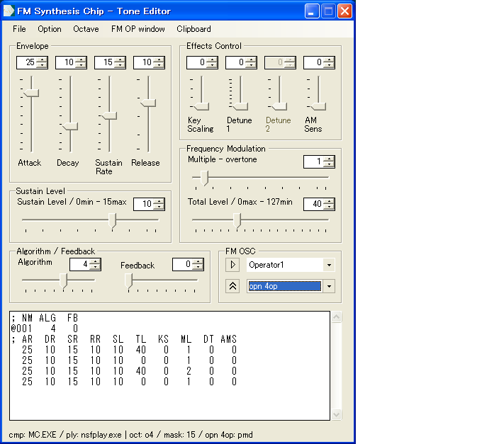
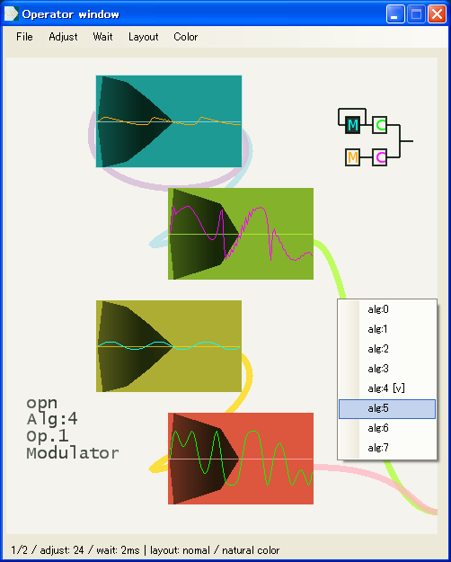
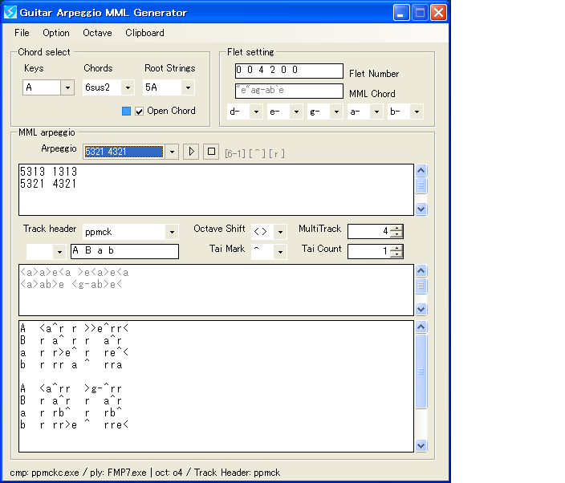
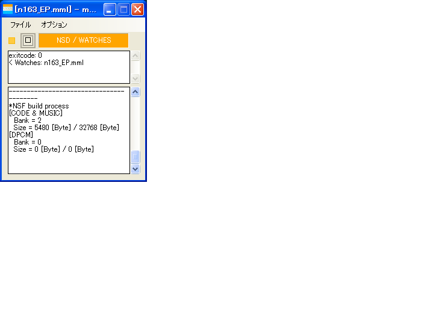
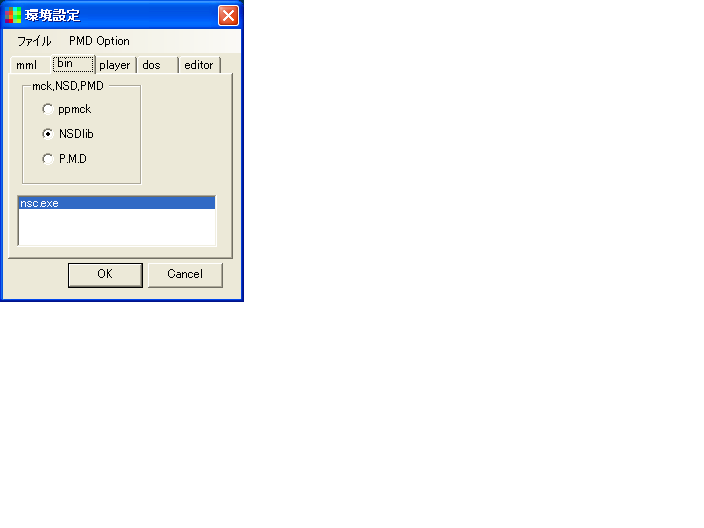

□ FM Editor Operator window 
 
2op,4op対応のFM音源音色エディタです。 
左上はエンベロープなど繊細なもの、右下は倍音など音色の決定要素を集めています。 
試聴機能による確認、各FM音源のmml(fmp7,mxdrv)からインポート、エクスポートもできます。 
 
 
 
 
□ FM Synthesis Chip - Tone Editor 
 
上記、FM音源音色エディタのサブウィンドウです。 
音色エディタのスライダーに連動し、合成波形が変わります。 
ウィンドウ内をクリックすることでも、エディットするオペレータ切替えができます。 
 
 
 
 
□ Guitar Arpeggio MML Generator 
 
ギターアルペジオMMLジェネレータです。 
各トラックにMMLを自動的に振り分け、串抜きMMLを自動生成します。 
 
 
 
 
□ Mml Watch GUI 
 
mmlチップチューンコンパイラをGUI化した、フロントエンドです。 
ppmck,nsdLib,P.M.Dに対応しています。 
 
 
 
 
□ Setting 
 
上記、フロントエンドの各file,exeなどを登録する設定画面です。 
ここで必要なファイルを、リストボックスへD&Dで登録します。 
 
 
 
 