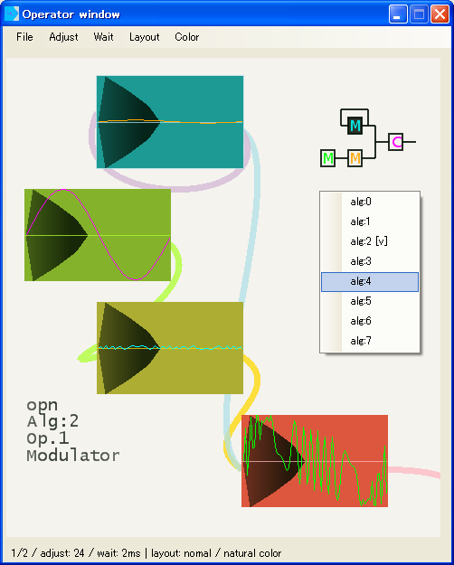

<h1>mml watch GUI</h1>

mmlチップチューンコンパイラppmck,nsdLib,P.M.D,のユーティリティ集です。 
GUIも含め総Powershellで組まれてます。 
 
(各バイナリexeは、シェルを呼び出すためのc#によるラッパーで、

中身の殆どはアイコンリソースです。) 
 
それぞれがスタンドアロン(単体)で起動します。 
 
<table><tr><td>・Mml Watch GUI</td><td>-- チップチューンのためのフロントエンド</td>
</tr><tr><td>・FM Synthesis Chip - Tone Editor</td><td>-- 2op.4op.対応FM音源チップエディタ</td>
</tr><tr><td>・Guitar Arpeggio - MML Generator</td><td>-- ギターアルペジオジェネレータ</td>
</tr></table>

<h5>対応OS: windowsXP以上 
 
mml_watch.exeなどのバイナリ起動の場合、.NET Framework4.0以上が必要となります。 
 
Watch.cmdなどのバッチファイルによる起動であれば、 
.NET Framework3.5以上(CLR:共通言語ランタイム2.0)、 
PowerShell2.0(WMF:WindowsManagementFramework2.0)以上なら動くと思います。</h5>

 
<h4>□ Mml Watch GUI</h4>

mmlチップチューンコンパイラをGUI化した、フロントエンドです。 
ppmck,nsdLib,P.M.Dに対応しています。 
 
 
 
 
<h4>■ Setting Panel</h4>

上記、フロントエンドの各file,exeなどを登録する環境設定です。 
ここで必要なファイルを、リストボックスへD&Dで登録します。 
(以下、Tone EditorとMML Generatorも、このパネルを呼び出すことができます。) 
 
 
 
 
<h4>□ FM Synthesis Chip - Tone Editor</h4>

2op,4op対応のFM音源音色エディタです。 
左上はエンベロープなど繊細なもの、右下は倍音など音色の決定要素を集めています。 
試聴機能による音色の確認、音色の保存、各FM音源のmml(fmp7,mxdrv)から、 
インポート、エクスポートができます。 
 
 
 
 
<h4>■ FM Editor Operator window</h4>

上記、FM音源音色エディタのサブウィンドウです。 
音色エディタのスライダーに連動し、合成波形が変わります。 
ウィンドウ内をクリックすることでも、エディットするオペレータ切替えができます。 
 
 
 
 
<h4>□ Guitar Arpeggio - MML Generator</h4>

ギターアルペジオMMLジェネレータです。 
各トラックにMMLを自動的に振り分け、串抜きMMLを自動生成します。 
 
 
 
 
