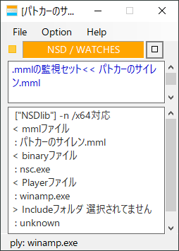

<h1>mml watch GUI</h1>

ChiptuneのMMLコンパイラへGUI環境を提供するフロントエンドです。 
"ppmck", "nsdLib", "P.M.D"へ対応します。 
 
GUI部も含め、総Powershellで組まれています。 
 
 
それぞれがスタンドアロン(単体)で起動します。 
 
<table><tr><td>・Mml Watch GUI</td><td>mmlチップチューンのfront end</td>
</tr><tr><td>・FM Synthesis Chip - Tone Editor</td><td>2op.4op.対応FM音源音色エディタ</td>
</tr><tr><td>・Guitar Arpeggio - MML Generator</td><td>ギターアルペジオジェネレータ</td>
</tr></table>

<h4>対応OS: windowsXP以上</h4>

<h5>
( 近日、ver4.5を用意する予定です、、) 
 
※テスト環境 
winXP+ Powershell2(.NET Framework3.5) 
win10+ Powershell5(.NET Framework4.8) 
win10+ Powershell7(.NET5) 
 
Watch.cmdなどのバッチファイルによる起動であれば、 
.NET Framework3.5以上、 
PowerShell2以上なら動くと思います。 
 
mml_watch.exeなどのバイナリ起動の場合、.NET Framework4.0以上が必要となります。 
 
※各起動バイナリexeについて 
シェルを呼び出すためのc#によるラッパーで、中身の殆どはアイコンリソースです。 
(開発環境を使用せず、直接.NETのコンパイラを通したため、トータルウィルスで僅かに引っかります。 
[XP上にて主に開発しているため、開発環境が入れられません、]　ご心配あらば、srcにあるcsファイルを開いてみて下さい。)
</h5>

<h4>必要となるソフトウェアのリンク  
・<a href="https://eseakisakura.github.io/"> Mml Watch GUI - download</a> 
 

<h4> Mml Watch GUI</h4>

<table><tr><td style="width: 240px;">
 
</td><td style="width: 320px;">

mmlによるchiptuneコンパイラをGUI化したフロントエンドです。 
 
ファイル更新チェッカとして機能、自動再生までサポートします。
ppmck、nsdLib、PMDに対応しています。 

</td></tr></table>

<h4>■□ Setting Panel</h4>

<table><tr><td style="width: 240px;">
 
</td><td style="width: 320px;">

必要なソフトウェアを登録する環境設定です。
リストボックスへDrug&Dropすることでパスを登録します。 
(以下のTone Editor、MML Generatorも、
このパス環境を使います。) 

</td></tr></table>

<h4> FM Synthesis Chip - Tone Editor</h4>

<table><tr><td style="width: 240px;">
 
</td><td style="width: 320px;">

2op(vrc7,opl),4op(opn,opm)対応のFM音源音色エディタです。 
 
音色の試聴、プリセット呼び出し、音色の一時保存や、 
 
2op.(ppmck,nsdLibのレジスタ音色含む)、
4op.(PMD,fmp7,mxdrv各音色形式)の、
インポート、エクスポートができます。 

</td></tr></table>

<h4>■□ FM Editor Operator window</h4>

<table><tr><td style="width: 240px;">
 
 
</td><td style="width: 320px;">

上記、FM音源音色エディタのサブウィンドウです。 
 
音色エディタのスライダーに連動し、合成波形表示が変わります。
(ウィンドウ内をクリックすることで、
エディットするオペレータ切替えができます。) 

</td></tr></table>

<h4>Guitar Arpeggio - MML Generator</h4>

<table><tr><td style="width: 240px;">
 
</td><td style="width: 320px;">

ギターアルペジオMMLジェネレータです。 
マルチトラックにMMLを自動的に振り分け、串抜きMMLを自動生成します。 

</td></tr></table>
