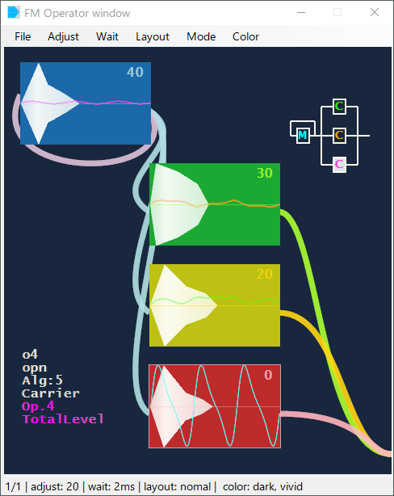

<h1>mml watch GUI</h1>

ChiptuneのMMLコンパイラ"ppmck","nsdLib","P.M.D",へGUI環境を提供する補助ツールです。
GUI部も含め、総Powershellで組まれてます。 
 
<h5>各起動バイナリexeは、シェルを呼び出すためのc#によるラッパーで、中身の殆どはアイコンリソースです。
(開発環境を使用しないで、直接.NETのコンパイラを通したためか、トータルウィルスの一部で引っかかります。 
[XP上にて開発しているため、開発環境が入れられません、、]ご心配であるならば、srcのcsファイルを開いてみて下さい。)</h5>
 
それぞれがスタンドアロン(単体)で起動します。 
 
<table><tr><td>・Mml Watch GUI</td><td>-- チップチューンのためのフロントエンド</td>
</tr><tr><td>・FM Synthesis Chip - Tone Editor</td><td>-- 2op.4op.対応FM音源音色エディタ</td>
</tr><tr><td>・Guitar Arpeggio - MML Generator</td><td>-- ギターアルペジオジェネレータ</td>
</tr></table>

<h4>対応OS: windowsXP以上</h4>

<h5>mml_watch.exeなどのバイナリ起動の場合、.NET Framework4.0以上が必要となります。 
 
Watch.cmdなどのバッチファイルによる起動であれば、 
.NET Framework3.5以上(CLR:共通言語ランタイム2.0)、 
PowerShell2.0(WMF:WindowsManagementFramework2.0)以上なら動くと思います。</h5>

 
<h4> Mml Watch GUI</h4>

mmlチップチューンコンパイラをGUI化したフロントエンドです。 
エディタ呼出しやファイル更新チェッカとして機能、自動再生までサポートします。 
ppmck,nsdLib,P.M.Dに対応しています。 
 
 
 
 
<h4>■ Setting Panel</h4>

上記、フロントエンドの各file,exeなどを登録する環境設定です。 
ここで必要なファイルを、リストボックスへDrug&Dropで登録します。 
(以下記載のTone EditorとMML Generatorも、このパネルを呼び出すことができます。) 
 
 
 
 
<h4> FM Synthesis Chip - Tone Editor</h4>

2op(vrc7など),4op(oplなど)対応のFM音源音色エディタです。 
(左上はエンベロープなど繊細なもの、右下は倍音など音色の決定要素を集めています。) 
試聴機能による音色の確認、音色の保存や、 
2op.のppmck,nsdLibのレジスタ音色のインポートとエクスポート、 
4op.であるfmp7,mxdrvの音色形式のインポート、エクスポートもできます。 
 
 
 
 
<h4>■ FM Editor Operator window</h4>

上記、FM音源音色エディタのサブウィンドウです。 
音色エディタのスライダーに連動し、合成波形が変わります。 
(ウィンドウ内をクリックすることでも、エディットするオペレータ切替えができます。) 
 
 
 
 
 
<h4>Guitar Arpeggio - MML Generator</h4>

ギターアルペジオMMLジェネレータです。 
マルチトラックにMMLを自動的に振り分け、串抜きMMLを自動生成します。 
 
 
 
 
