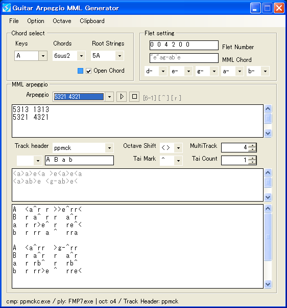
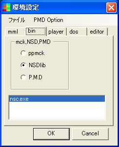

□ FM Editor Operator window  
 
2op,4op対応のFM音源音色エディタです。 
左上はエンベロープなど繊細なもの、右下は倍音など音色の決定要素を集めています。 
 

□ FM Synthesis Chip - Tone Editor  
 
FM音源音色エディタのサブウィンドウです。 
ウィンドウ内をクリックすることで、エディットするオペレータを変更できます。 
 

□ Guitar Arpeggio MML Generator  
 
ギターアルペジオMMLジェネレータです。 
各トラックにMMLを自動的に振り分け、串抜きMMLを自動生成します。 
 

□ Mml Watch GUI  
 
mmlチップチューンコンパイラをGUI化した、フロントエンドです。 
ppmck,nsdLib,P.M.Dに対応します。 
 

□ Setting  
 
各file,exeなどを登録する設定画面です。 
ここで必要なファイルを、リストボックスへD&Dで登録します。 
 
